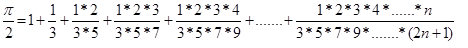

# PTA 期末练习题

> 适用于非信工非地信学生
> 任何售卖行为与我无关
> 加减乘除类的简单题不收录
> 建议看完自己默写或者手敲一遍

## 题1：二维数组的行最大值与列最小值的平均值

本题要求实现一个函数，计算n行5列的二维数组中每一行的最大值及每一列的最小值所有数的平均值。题目保证每行每列只有一个符合要求的元素。

### 函数接口定义：
```cpp
double Average(double a[][M],int n);
```

### 画图模拟一遍很好理解
```cpp
double Average(double a[][M], int n) {
    double sum = 0;
    
    // 计算每行的最大值并累加到总和
    for (int i = 0; i < n; i++) {
        double max = a[i][0];
        for (int j = 1; j < M; j++) {
            if (a[i][j] > max) {
                max = a[i][j];
            }
        }
        sum += max;
    }
    
    // 计算每列的最小值并累加到总和
    for (int j = 0; j < M; j++) {
        double min = a[0][j];
        for (int i = 1; i < n; i++) {
            if (a[i][j] < min) {
                min = a[i][j];
            }
        }
        sum += min;
    }
    
    // 返回平均值
    return sum / (n + M);//注意这个括号，确保运行顺序哈。。
}
```

---

## 题2：计算最大公约数

编写函数gcd，计算2个非负整数的最大公约数，可以用辗转相除法。

### 函数接口定义：
```cpp
int gcd(int m, int n);
```

### 记住就行
```cpp
int gcd(int a, int b) {
    while (b != 0) {  // 当 b 不为 0 时循环
        int t = b;    // 保存 b 的值
        b = a % b;    // 计算 a 除以 b 的余数，赋值给 b
        a = t;        // 将之前保存的 b 的值赋值给 a
    }
    return a;         // 当 b 为 0 时，a 就是最大公约数
}                       //tbb a模b ata 理解不了记住就行了
```

---

## 题3：判断素数

编写函数isPrime，判断某个正整数（大于等于2）是否为素数，函数返回bool类型参数。

### 函数接口定义：
```cpp
bool isPrime(int num);
```

### 记死就行
```cpp
bool isPrime(int n) {
    if (n <= 1) return false;
    for (int i = 2; i * i <= n; i++) { // 只需要检查到 sqrt(n)//一定记得从二开始
        if (n % i == 0) return false;  // n能被i整除，则n不是质数
    }
    return true;
}
```

---

## 题4：斐波那契数列

编写函数fibo，计算斐波那契数列的前n项并存储在数组中。

### 函数接口定义：
```cpp
void fibo(int a[], int n);
```

### 裁判测试程序样例：
```cpp
#include <iostream>
using namespace std;
void fibo(int a[],int n ); 
int main()
{
    int a[20],n,i;
    cin>>n;
    fibo(a,n);
    for(i=0;i<n;i++)
        cout<<a[i]<<"  ";
    cout<<endl;
    return 0;
}
/* 你的代码将被嵌在这里 */
```

### 题解：
```cpp
void fibo(int a[], int n) {
    // 处理前两项
    if (n >= 1)  a[0] = 1;  // 第0项 = 1
    if (n >= 2)  a[1] = 1;  // 第1项 = 1
    
    // 从第2项开始计算后续项
    for (int i = 2; i < n; i++)  // 从索引2遍历到n-1
    {
        a[i] = a[i - 2] + a[i - 1];  // 当前项 = 前两项之和
    }
}
```

---

## 题5：有序数组插入

向一个有序数组a中插入一个数据，使其依然保持有序性。如数组a={1,3,5,7,9}，插入4后的a是{1,3,4,5,7,9}。

### 函数接口定义：
```cpp
bool insert(int a[], int &n, int N, int key);
```
- `a` 是int型数组，有`n`个有序元素（由小到大）；
- `key` 要插入的值；
- `N` 是数组a的最大长度；
- 函数返回值为`true`表示插入成功，同时`n`的值+1，返回`false`表示插入失败（数组已满）。

### 裁判测试程序样例：
```cpp
#include<iostream>
using namespace std;
void print(int a[], int n);
bool insert(int a[], int &n, int N, int key);

int main()
{
    const int N = 5;
    int a[N]={11,15,21};
    int n=3;                //数组n的实际长度

    int key;               //要插入的元素值
    int t;                 //要插入的元素个数
    cin >> t;
    for(int i=1;i<=t;i++)
    {
       cin >> key;
       if(insert(a,n,N,key))
           print(a,n);
       else
       {
           cout << "insert fail.";
           break;
       }
    }

    return 0;
}

void print(int a[], int n)
{
    for(int i=0; i<n; i++)
       cout << a[i] << " ";
    cout << endl;
}

/* 请在这里填写答案 */
```

### 题解：
```cpp
bool insert(int a[], int &n, int N, int key) {
    // 检查数组是否已满
    if (n >= N) {
        return false; // 数组已满，插入失败
    }
    
    int i = n - 1; // 从数组最后一个元素开始
    
    // 从后向前查找插入位置
    while (i >= 0 && a[i] > key) {
        a[i + 1] = a[i]; // 将大于key的元素后移一位
        i--; // 继续向前比较
    }
    
    a[i + 1] = key; // 在正确位置插入key，前面--退了一位
    n++; // 数组元素个数增加1,写n+=1也行
    return true; // 插入成功
}
```

---

## 题6：删除数组元素

编写函数，删除数组中指定位置处的元素。删除数组中的某个元素时，其后的所有元素需要顺序向前移动。

### 函数接口定义：
```cpp
void delNum(int a[], int n, int x);
```
其中 `a` 是待删除元素的数组，`n` 是删除前数组元素的个数，`x` 为待删除元素的位置（从0开始数）。

### 裁判测试程序样例：
```cpp
#include<iostream>
using namespace std;
void delNum(int a[],int n,int x);
int main()
{
    const int N=10;
    int a[N]={10,111,102,213,124,415,176,170,179,19},x;
    cout<<"请输入待删除元素的位置(0~9):";
    cin>>x;
    delNum(a,N,x);
    for(int i=0;i<N-1;i++)
        cout<<a[i]<<" ";
    return 0;
}
/* 你的代码将被嵌在这里 */
```

### 题解：
```cpp
void delNum(int a[], int n, int x) {
    // 检查删除位置是否有效
    if (x < 0 || x >= n) {
        return; // 无效位置，直接返回
    }
    
    // 从待删除位置开始，将其后的元素向前移动一位
    for (int i = x; i+1 <= n ; i++) {// 小心越界
        a[i] = a[i + 1]; // 后一元素覆盖当前元素
    }
}
```
# 25春基础题集
## 题1：统计字符数组长度
编写函数strLength，计算字符串的实际有效字符的个数，函数传入参数为字符串的起始地址，返回字符串中有效字符数量。
### for循环
```cpp
int strLength(char str[]){
    int i;
    for( i = 0; str[i] != '/0'; i++);//注意是反斜杠，不是正斜杠
    return i;//代码不理解就去问豆包老师哈。。。
    
}
```
## 题2:判断水仙花
水仙花数是指一个三位正整数，它的每个位上的数字的3 次幂之和等于它本身。例如：153=1 
的3次+5的3次+5的3次，则153 是水仙花数。 本题要求编写一个函数判断给定整数是否是水仙花数。

### 记住取位运算
```cpp
bool narcissistic(int number) {
    // 仅处理三位数
    if (number >= 100 && number <= 999) {
        int hundreds = number / 100;       // 百位
        int tens = (number / 10) % 10;     // 十位
        int units = number % 10;           // 个位
        
        // 计算各位数字的立方和
        int sum = hundreds * hundreds * hundreds + tens * tens * tens + units * units * units;
        
        // 判断是否为水仙花数
        return (number == sum);
    }
    
    // 非三位数直接返回false
    return false;
}
```
## 题3 计算π值
使用级数展开计算π值。

### 记住循环条件否则会超时
```cpp
double pai() {
    double ans = 1.0;
    double temp = 1.0;
    double n = 1.0; 
    
    // 当项小于1e-8时停止计算
    while (temp >= 1e-8) {
        temp *= n / (2 * n + 1); //注意括号
        ans += temp;
        n += 1.0; 
    }
    return 2 * ans; 
}
```
## 题4 奇数和函数
题目要求，需要实现两个函数：一个用于判断整数奇偶性，另一个用于计算数组中所有奇数的和。
### 注意函数嵌套
```c
// 判断整数n的奇偶性：偶数返回1，奇数返回0
int even(int n) {
    return (n % 2 == 0) ? 1 : 0;//三目运算符，也可以用if语句；不懂问豆包老师。
}

// 计算数组中所有奇数的和
int OddSum(int List[], int N) {
    int sum = 0;
    int i;
    
    for (i = 0; i < N; i++) {
        // 如果是奇数（even函数返回0），则累加到总和
        if (even(List[i]) == 0) {
            sum += List[i];
        }
    }
    
    return sum;
}
```

## 题5 数组右移函数


函数接口定义：
void ArrayShift( int a[], int n, int m );
其中a[]是用户传入的数组；n是数组的大小；m是右移的位数。函数ArrayShift须将循环右移后的数组仍然存在a[]中。

裁判测试程序样例：
```c
#include <stdio.h>
#define MAXN 10
void ArrayShift( int a[], int n, int m );

int main()
{
    int a[MAXN], n, m;
    int i;
    
    scanf("%d %d", &n, &m);
    for ( i = 0; i < n; i++ ) scanf("%d", &a[i]);
    
    ArrayShift(a, n, m);
    
    for ( i = 0; i < n; i++ )
    {
        if (i != 0) printf(" ");
        printf("%d", a[i]);
    }
    printf("\n");
    
    return 0;
}

/* 你的代码将被嵌在这里 */
```
### 自己打草稿画图模拟即可
```cpp
void ArrayShift(int a[], int n, int m) {
    // 处理m大于n的情况，取模后得到实际需要移动的位数
    m = m % n;
    
    if (m == 0) return; // 如果m为0，不需要移动
    
    int temp[MAXN]; // 临时数组用于存储移动后的结果
    
    // 将后m个元素复制到临时数组的前面
    for (int i = 0; i < m; i++) {
        temp[i] = a[n - m + i];
    }
    
    // 将前n-m个元素复制到临时数组的 后面
    for (int i = 0; i < n - m; i++) {
        temp[m + i] = a[i];
    }
    
    // 将临时数组中的结果复制回原数组
    for (int i = 0; i < n; i++) {
        a[i] = temp[i];
    }
}
```

## 题6 二分查找

函数为二分法查找key值。数组中元素已递增排序,若找到key则返回对应的下标，否则返回-1。
其中 a 、n 和 key 都是用户传入的参数。函数用二分法查找key 值。数组 a 中的n 个元素已递增排序,若找到key 则返回对应的下标，否则返回-1数。

裁判测试程序样例：
```cpp
#include <stdio.h>
int fun(int a[],int n,int key);
int main()
{
  int a[10]={1,2,3,4,5,6,7,8,9,10}, b,c;
  b=4;
  c=fun(a,10,b);
  if(c==-1)printf("not found");
  else printf("position %d\n",c);
  return 0;
}
```
### 解
```cpp
int fun(int a[], int n, int key) {
    int left = 0;           // 左边界
    int right = n - 1;      // 右边界
    int mid;                // 中间位置
    
    // 当左边界小于等于右边界时，继续查找
    while (left <= right) {
        mid = left + (right - left) / 2;  // 计算中间位置，避免溢出
        
        if (a[mid] == key) {
            return mid;  // 找到目标值，返回下标
        } else if (a[mid] < key) {
            left = mid + 1;  // 目标值在右半部分，调整左边界
        } else {
            right = mid - 1;  // 目标值在左半部分，调整右边界
        }
    }
    
    return -1;  // 未找到目标值，返回-1
}
```


## 题7 删除重复整数
要求实现一个函数，删去给定非负整数数组中的重复整数（整数数值不超过100），不重复的元素放于原数组中，不要改变原来的次序。该函数返回不重复的整数个数。
### 解  关键是if语句那里弄清楚下标之间的关系
```cpp
int Unique_Int(int a[], int n) {
    if (n == 0) return 0;  // 处理空数组情况
    
    bool seen[101] = {false};  // 标记数组，初始化为false（0-100）,注意中括号
    int j = 0;  // 指向当前不重复序列的末尾
    
    for (int i = 0; i < n; i++) {
        // 若当前数字未出现过
        if (!seen[a[i]]) {
            seen[a[i]] = true;  // 标记为已出现
            a[j] = a[i];        // 将当前数字放入不重复序列
            j++;                // 移动指针
        }
    }
    return j;  // 返回不重复整数个数
}
```

## 题8 数组最大值
编写函数getMax，传入数组起始地址及数组元素个数，返回该数组的最大
值，
> 在 C++ 中，数组名可以视为指向数组第一个元素的指针（即首地址）。当我们传递数组给函数时，实际上传递的是数组的首地址，这使得我们可以在函数内部通过指针操作访问整个数组。


### 解
```cpp
int getMax(int *pa, int size) {
    int max = pa[0];  // 初始化为数组第一个元素
    
    // 遍历数组元素
    for (int i = 1; i < size; i++) {
        // 如果当前元素大于当前最大值，则更新最大值
        if (pa[i] > max) {
            max = pa[i];
        }
    }
    
    return max;  // 返回最大值
}
```

## 题9 字符串比较
编写函数，实现2个字符串(串长小于80）按照词典顺序的比较。
- 如果s1 和s2 相等，函数返回0，
- 如果s1和s2 不等，返回2 个字符串中从左向右第一个不相等字符的ASCII 码差值，若果s1>s2，返回正值，若果s1<s2，返回负值。
### 解
```cpp
int stringcmp(char *s1, char *s2) {
    // 同时遍历两个字符串
    while (*s1 != '\0' && *s2 != '\0') {
        // 如果字符不相等，返回ASCII差值
        if (*s1 != *s2) {
            return *s1 - *s2;
        }
        // 移动到下一个字符
        s1++;
        s2++;
    }
    // 处理字符串长度不等的情况
    return *s1 - *s2;
}
```

## 题10 类成员函数

实现1个简单的二维点类。构造函数可以用初始化列表实现对数据成员的初
始化。
- 实现各个成员函数。
- 实现Point 类中的成员函数getDistance，计算两点之间距离。
- 定义普通函数getDistance，计算2 点之间距离

从键盘输入两点的坐标，分别用成员函数和普通函数计算这两点的距离。
```cpp
类的定义：
class Point
{
   public:
    Point( double newX=0, double newY=0);
    void setValue(double newX, double newY);
    double getX( );
    double getY();
    double getDistance(Point& p2);  
   private:
    double x, y;
};
其中 x 和y是数据成员，本别表示点的x坐标和y坐标。

裁判测试程序样例：

#include <iostream>
#include <cmath>
using namespace std;
class Point
{
   public:
    Point( double newX=0, double newY=0);
    void setValue(double newX, double newY);
    double getX( );
    double getY();
    double getDistance(Point& p2);    //成员函数计算距离
   private:
    double x, y;
};

double getDistance(Point& p1, Point& p2);  //普通函数计算距离

int main()
{  Point p1,p2;
   double x1,y1,x2,y2;
   cin>>x1>>y1>>x2>>y2;
   p1.setValue(x1,y1);
   p2.setValue(x2,y2);
   double dis1 = p1.getDistance(p2); //成员函数版本计算
   cout<<"Distance: "<<dis1<<endl;
   double dis2 = getDistance(p1,p2); //普通函数版本计算
   cout<<"Distance: "<<dis2<<endl;
   return 0;
}
/* 请在这里填写答案 */
```
### 解
```cpp
// 构造函数（使用初始化列表）
Point::Point(double newX, double newY) : x(newX), y(newY) {}
类名::构造函数名(参数列表) : 成员变量1(初始值), 成员变量2(初始值), ... {函数体}
// 设置点坐标
void Point::setValue(double newX, double newY) {
    x = newX;
    y = newY;
}

// 获取x坐标
double Point::getX() {
    return x;
}

// 获取y坐标
double Point::getY() {
    return y;
}

// 成员函数计算两点距离
double Point::getDistance(Point& p2) {
    double dx = x - p2.x;
    double dy = y - p2.y;
    return sqrt(dx * dx + dy * dy);
}

// 普通函数计算两点距离
double getDistance(Point& p1, Point& p2) {
    double dx = p1.getX() - p2.getX();
    double dy = p1.getY() - p2.getY();
    return sqrt(dx * dx + dy * dy);
}
```


#### 作者 ： 
工程技术学院 安全工程 24 级 
**江旭**  wx: Lucky_encounter1216 qq:3465192960
***2025年6月***

#### 更多真题详见
**https://github.com/jiangxu05/notes/tree/master** 内的“25春复习题”及 “题-PTA-课堂“
- ”课堂”文件夹内包含本学期90%上机题目及解析，但个人解法包含少许超纲内容。
- 网络卡顿请开VPN或刷新等待
