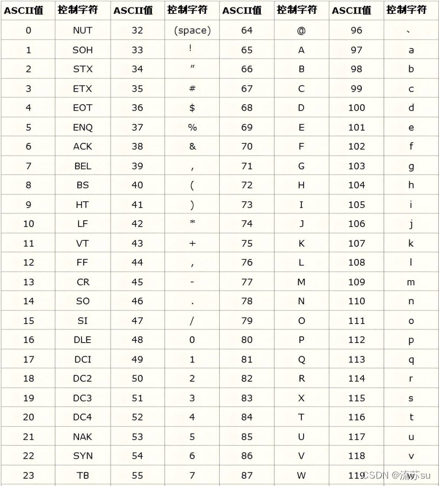

-  输入一个完全平方数x，将x-1分解成两个数的乘积，使得这两个数的差最小

```
#include<iostream>
#include<cmath>
using  namespace std;

int main(){
    int  x;
    cin >> x;
    int a = sqrt(x-1);
    int b = (x - 1) / a;
    cout << a << " " << b << endl;
    return 0;
}
```
---

-  给r，给d，求h；都要是整数；r的平方加d的平方开根号后减去r，那如何保证h是整数呢？
```
#include<iostream>
#include <cmath>
using namespace std;

int main(){
    long  long  r,d;//  题目说d小于10的五次方，计算式子里面有平方，超过了10的九次方（int）所以要用long long
    cin >> r >> d;
    double h = sqrt(r*r + d*d) - r;
    cout << (int)h << endl;
    return  0;
}
```

---

-   输入double类型圆的半径r，定义圆周率3.14，求面积和周长,保留两位小数；
```
#include<iostream>
#include<iomanip>
using namespace std;

int  main(){
    double r;
    cin >> r;
    const  double pi = 3.14;
    double s = pi * r * r;
    double l = 2 * pi * r;
    cout << fixed << setprecision(2) <<"area="<< s << endl << "circle="<< l << endl;//注意可以连续设置精度
    return 0 ;
}
```
---

-  编写程序，输入3个整数，判断并输出以这3个整数作为边长能否构建1个有效的三角形。
```
#include<iostream>
using namespace std;

int main(){
    int a,b,c;
    cin >> a >> b >> c;
    if(a + b > c && a + c > b && b + c > a) cout << "yes" << endl; //要想到和熟悉逻运算符
    else cout << "no" << endl;
    return 0;
}
```
---
- T8，判断水仙花数,并且要判断是否为三位数；
```
#include<iostream>
using namespace std;

int main(){
    int n;
    cin >> n;
    if(n < 100 || n > 999) cout << "no" << endl;
    else{
        int a = n / 100;
        int b = n / 10 % 10; //强化记忆一下取位数
        int c = n % 10;
        if(n == a * a * a + b * b * b + c * c * c) cout << "yes" << endl;
        else cout << "no" << endl;
    }
}
```
---

- 在语言学研究中，字符的分类是一个基础而重要的任务。编写一个程序，
帮助语言学家快速判断输入的字符是元音字母（即发音时声带振动的字母a(A)、e(E)、i(I)、o(O)、u(U)）。 
-  辅音字母（即发音时声带不振动或发音与元音不同的字母）、数字还是其他类型的字符。
-  输出包括元音字母、辅音字母、数字、其他。
> 

> 元音字母：
英语中的元音字母是 a(A)、e(E)、i(I)、o(O)、u(U)。
它们的 ASCII 码分别是：
大写：**A (65)**、E (69)、I (73)、O (79)、U (85)。
小写：**a (97)**、e (101)、i (105)、o (111)、u (117)。  

> 辅音字母：
英语中除了元音字母的其他字母都是辅音字母。
它们的 ASCII 码范围是：
大写：B (66) 到 Z (90)，不包括元音字母。
小写：b (98) 到 z (122)，不包括元音字母

```
#include<iostream>
using namespace std;

int main(){
    char c;
    cin >> c;
    if(c == 'a' || c == 'A' || c == 'e' || c == 'E' || c == 'i' || c == 'I' || c == 'o' || c == 'O' || c == 'u' || c == 'U') cout << "元音字母" << endl;
    else if(c >= '0' && c <= '9') cout << "数字" << endl;
    else if((c >= 'a' && c <= 'z') || (c >= 'A' && c <= 'Z')) cout << "辅音字母" << endl;
    else cout << "其他" << endl;
    return 0;
}//不对，本题好像不需要用到ascii表
```


---

-  同学们都爱点外卖，外卖费用的计算有点麻烦，请你帮忙编程计算一下。如果外卖重量在1000克以内（含1000克），外卖费4元，超过1000克每500克加收3元，不足500克按500克收费，如果选择加急则另外加5元。
//输入为正整数n和是否加急的字符y或n，y表示加急，n表示不加急。
```
#include<iostream>
using namespace std;

int main(){
    int n;
    char m;
    cin >>n >> m;
    int a = n / 500; //关键是那句不足500克按500克收就这样方便
    if(n % 500 != 0) a++;//模拟
    int b = 4 + 3 * (a - 2);//模拟知道这里是-2；
    if(n <= 1000) b = 4;//这句是为了防止n小于500的情况
    if(m == 'y') b += 5;
    cout << b << endl;
    return 0;

}
```