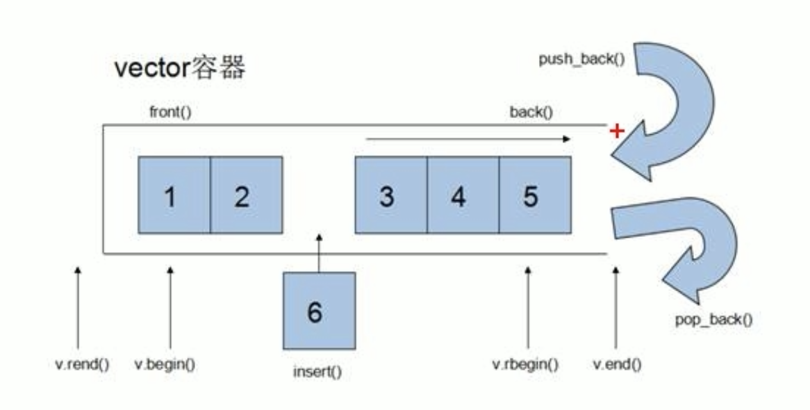

## 基本概念
区别：数组是静态空间，vector是动态扩展
> 动态扩展不是在原空间接续新空间，而是找到更大的空间，将原数据拷贝，释放原空间。



### - ***打印接口***
```
void printvector(vector<int>& v){
    for(vector<int>::iterater it = v.begin(); it != v.end();i++{
        cout<< *it << " ";
    })
}
```
## 构造
```
vector<int> v0;
// 1. 创建空vector; 常数复杂度
v0.reserve(3);// 1+. 这句代码可以使得向vector中插入前3个元素时，保证常数时间复杂度
vector<int> v1(3);
vector<int> v2(3, 2);
// 3. 创建一个初始空间为3的vector，其元素的默认值是2; 线性复杂度
vector<int> v3(3, 1, v2.get_allocator());
// 4. 创建一个初始空间为3的vector，其元素的默认值是1，
// 并且使用v2的空间配置器; 线性复杂度
vector<int> v4(v2);
// 5. 创建一个v2的拷贝vector v4， 其内容元素和v2一样; 线性复杂度
vector<int> v5(v4.begin() + 1, v4.begin() + 3);
// 6. 创建一个v4的拷贝vector v5，其内容是{v4[1], v4[2]}; 线性复杂度
vector<int> v6(std::move(v2));
// 7. 移动v2到新创建的vector v6，不发生拷贝; 常数复杂度; 需要 C++11// 或者 v6 = std::move(v2);
```
## 访问
``` 1.at()```
> v.at(pos) 返回容器中下标为 pos 的引用。如果数组越界抛出std::out_of_range 类型的异常。

```2.operator[]```
> v[pos] 返回容器中下标为 pos 的引用。不执行越界检查。

```
v.front() 返回首元素的引用。
v.back() 返回末尾元素的引用。
v.data() 返回指向数组第一个元素的指针。
```
## 迭代器
```begin()/cbegin()```
返回指向首元素的迭代器，其中 *begin = front。

```end()/cend()```
返回指向数组尾端占位符的迭代器，注意是没有元素的。

```rbegin()/crbegin()```
返回指向逆向数组的首元素的逆向迭代器，可以理解为正向容器的末元素。

```rend()/crend()```
返回指向逆向数组末元素后一位置的迭代器，对应容器首的前一个位置，没有元素。
## 长度和容量
vector 有以下几个与容器长度和容量相关的函数。注意，vector 的长度（size）指有效元素数量，而容量（capacity）指其实际分配的内存长度

- 与长度相关
```empty()``` 返回一个 bool 值，即 v.begin() == v.end()，true 为空，false 为非空。
```size()``` 返回容器长度（元素数量），即```std::distance(v.begin(), v.end())```。
```resize()``` 改变 vector 的长度，多退少补。补充元素可以由参数指定。
```max_size()```返回容器的最大可能长度。

- 与容量相关
```reserve()``` 使得 vector 预留一定的内存空间，避免不必要的内存拷贝。
```capacity()``` 返回容器的容量，即不发生拷贝的情况下容器的长度上限。
```shrink_to_fit()``` 使得 vector 的容量与长度一致，多退但不会少。
## 增删及修改
```clear()``` 清除所有元素
```insert()``` 支持在某个迭代器位置插入元素、可以插入多个。复杂度与pos 距离末尾长度成线性而非常数的
```erase()``` 删除某个迭代器或者区间的元素，返回最后被删除的迭代器。复杂度与 insert 一致。
```push_back()``` 在末尾插入一个元素，均摊复杂度为 常数，最坏为线性复杂度。
```pop_back()``` 删除末尾元素，常数复杂度。
```swap()``` 与另一个容器进行交换，此操作是 常数复杂度 而非线性的。
## 赋值操作
- 等号
- assign
```
vector<int>v4;
v4.assign(v1.begin(),v1.end());
printvectorv4;
```
- assign,n个elem;
```
vector<int>v5;
v5,assign(10,100);
printvector(v5);
```

## vector容量和大小
```
if(v1.empty()){
    cout <<"v1为空"<<endl;
}
else {
    cout <<"v1的容量为: "<<v1.capacity()<<endl;
    cout << "v1的大小为: "<<v1.size()<<endl;//容量永远大于等于大小
}
//重新指定大小
v1.resize(15);//默认空的补0
v1.resize(15.100);//使用100来填充
v1.resize(5);//超出的会被删掉
```
## vector插入和删除
```
v1.push_back(ele); //尾部插入elm
v1.pop_back();//删除最后一个元素
v1.insert(v1.begin(),2,100);//在第一个元素后插入两个一百
v1.erase(v1.begin());//删掉第一个元素
v1.erase(v1.begin(),v1.end());//全删完了
```
## 数据存取
```
for (int i = 0; i < v1.size(); i++){
    cout << v1[i] << " ";//也可以v1.at(i)
}
cout << endl;

//第一个元素
cout << v1.front() << endl;

//第二个元素
cout << v1.back() << endl;
```
## 互换容器
```
//在void test01中加上：
vector<int.v2;
for (int i =10; i>0; i--){
    v2.push_back(i);
}


//交换
v1.swap(v2);


//实际用途，巧用swap收缩内存空间；
```
- string 则是一个简单的类，使用简单，在 OI 竞赛中被广泛使用。并且相较于其他 STL 容器，string 的常数可以算是非常优秀的，基本与字符数组不相上下。
- string 能动态分配空间，这使得我们可以直接使用 std::cin 来输入，但其速度则同样较慢。这一点也同样让我们不必为内存而烦恼。

## 获取长度
cout << "s 的长度为 " << s.size() << endl;
cout << "s 的长度为 " << s.length() << endl;
cout << "s 的长度为 " << strlen(s.c_str()) << endl;

## 找某字符（串）第一次出现的位置
string s = "OI Wiki", t = "OI", u = "i";
int pos = 5;
cout << "字符 I 在 s 的 " << s.find('I') << " 位置第一次出现" << endl;
cout << "字符 a 在 s 的 " << s.find('a') << " 位置第一次出现" << endl;
cout << "字符 a 在 s 的 " << static_cast<int>(s.find('a')) << " 位置第一次出现" << endl;
cout << "字符串 t 在 s 的 " << s.find(t) << " 位置第一次出现" << endl;
cout << "在 s 中自 pos 位置起字符串 u 第一次出现在 " << s.find(u, pos) << " 位置" << endl;
- 输出
```
字符 I 在 s 的 1 位置第一次出现
字符 a 在 s 的 18446744073709551615 位置第一次出现 // 即为 size_t(-1)，具体数值与平台有关。
字符 a 在 s 的 -1 位置第一次出现 // 强制转换为 int 类型则正常输出 -1
字符串 t 在 s 的 0 位置第一次出现
在 s 中自 pos 位置起字符串 u 第一次出现在 6 位置
```

## 截取子串
substr(pos, len) 函数的参数返回从 pos 位置开始截取最多 len 个字符组成的字符串（如果从 pos 开始的后缀长度不足 len 则截取这个后缀）。
string s = "OI Wiki", t = "OI";
cout << "从字符串 s 的第四位开始的最多三个字符构成的子串是 " << s.substr(3, 3) << endl;
cout << "从字符串 t 的第二位开始的最多三个字符构成的子串是 " << t.substr(1, 3) << endl;
- 输出
```
从字符串 s 的第四位开始的最多三个字符构成的子串是 Wik
从字符串 t 的第二位开始的最多三个字符构成的子串是 I
```

## 插入/删除字符（串）
string s = "OI Wiki", t = " Wiki";
char u = '!';
s.erase(2);
cout << "从字符串 s 的第三位开始删去所有字符后得到的字符串是 " << s << endl;
s.insert(2, t);
cout << "在字符串 s 的第三位处插入字符串 t 后得到的字符串是 " << s << endl;
s.insert(7, 3, u);
cout << "在字符串 s 的第八位处连续插入 3 次字符串 u 后得到的字符串是 " << s << endl;


## 替换字符（串）
string s = "OI Wiki";
s.replace(2, 5, "");
cout << "将字符串 s 的第 3~7 位替换为空串后得到的字符串是 " << s << endl;
s.replace(s.begin(), s.begin() + 2, "NOI");
cout << "将字符串 s 的前两位替换为 NOI 后得到的字符串是 " << s << endl;


# 赋值操作
```
只记录下常见的：
void test1(){
    string str;
    str = "hello,world";
    cout << str;
}
void test2(){
    string str1;
    str1.assign("hello c++");
    cout << str1;
}
```

# 字符串拼接
```
void test3(){
    string str3 ="我";
    str3 += "爱学习";  //也可以strn1 + strn2;
    str4 = "肯定必须一定“;
    str4.append(str3,4，2);//变成一定我爱学习
}
```