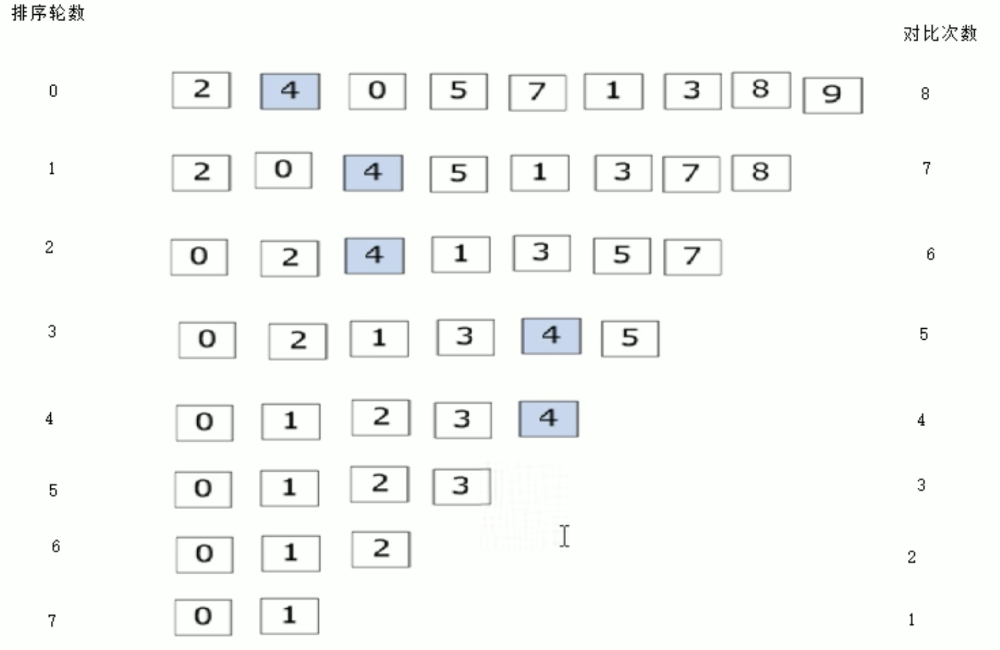

## 定义方式：
    1.数据类型 数组名[数组长度]；
    2.数据类型 数组名[数组长度] = {值1,值2,值3,...}；
    3.数据类型 数组名[] = {值1,值2,值3,...}；
## 访问方式：
    数组名[下标]； 下标从0开始；
- **利用for循环输出**
```
for (int i = 0; i < 5; i++){
    cout << arr[i] << endl;
}
```
## 数组名用途
- 数组名是常量不可赋值

```
int arr[10] = {1,2,3,4,5,6,7,8,9,10};
cout <<"整个数组占用空间:"<< sizeof(arr) << endl;   // 40 = 4*10
cout <<"每个元素占用内存空间:"<<sizeof(arr[0])<< endl;
cout <<“数组中元素个数为:"<< sizof(arr0) / sizeof(arr[0]) << endl;
cout <<"数组中首地址为:“<< (int)arr  << endl;      //(int)用来十六进制转十进制
cout <<"数组中第一个元素地址为:"<< (int)&arr[0] << endl; //&为取址符
```
## 案例关键点
- 元素逆置示意图

- 冒泡排序示意图
    - 排序总轮数 = 元素个数-1
    - 每轮对彼次数 = 元素个数 - 排序轮数 - 1

