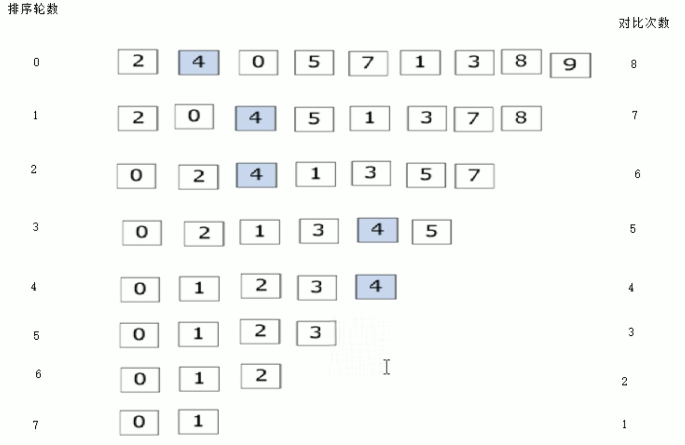

# 函数
### 语法
```
返回值类型 函数名 （参数列表即要传入的数据 ）{
    函数体语句
    return表达式 
}

eg.
int add(int num1, int num2){
    int sum = num1 + num2;
    return sum;
}
```
### 使用函数
```
#include <iostream>
using namespace std;

int max (int a, int b);             // 函数声明, 也可以不写，但是要把函数定义放在main函数前面；声明可以写多次，定义只能写一次

int max (int a, int b) {            // 函数定义
    return a > b ? a : b;           // 三目运算符：如果a>b为真，返回a，否则返回b
}

int main() {
    int a = 10, b = 20;
    cout << "较大的数是：" << max(a, b) << endl;
    return 0;
}
```
# 数组
### 定义方式：
    1.数据类型 数组名[数组长度]；
    2.数据类型 数组名[数组长度] = {值1,值2,值3,...}；
    3.数据类型 数组名[] = {值1,值2,值3,...}；


## 数组名用途
- 数组名是常量不可赋值

```
int arr[10] = {1,2,3,4,5,6,7,8,9,10};
cout <<"整个数组占用空间:"<< sizeof(arr) << endl;   // 40 = 4*10
cout <<"每个元素占用内存空间:"<<sizeof(arr[0])<< endl;
cout <<“数组中元素个数为:"<< sizof(arr0) / sizeof(arr[0]) << endl;
cout <<"数组中首地址为:“<< (int)arr  << endl;      //(int)用来十六进制转十进制
cout <<"数组中第一个元素地址为:"<< (int)&arr[0] << endl; //&为取址符
```
## 案例关键点
- 元素逆置示意图

- 冒泡排序示意图
    - 排序总轮数 = 元素个数-1
    - 每轮对彼次数 = 元素个数 - 排序轮数 - 1


## 二维数组的四种定义方式：
1. 数据类型 数组名[行数][列数];
2. 数据类型 数组名[行数][列数] = {{数据1，数据2},{数据3，数据4}};  
- 这种更直观，提高代码的可读性  
```
int arr[2][3] ={
    {1,2,3},
    {4,5,6}
}
```
> 
3. 数据类型 数组名[行数][列数] = {数据1，数据2，数据3，数据4};
4. 数据类型 数组名[][列数] = {数据1，数据2，数据3，数据4};

- 利用双for循环输出二维数组
```
for (int i = 0; i < 2; i++){
    for (int j = 0; j < 3; j++){
        cout<< arr[i][j] << endl;
    }
}
```
## 二维数组名：
- 查大小
```
cout << “二维数组行数为” << sizeof(arr)/sizeof(arr[0]) << endl;
cout << “二维数组列数为” << sizeof(arr[o])/sizeof(arr[0][0]) << endl;
cout << "二维数组第一个元素首地址“ << (int)&arr[0][0] << endl;
```


# 指针
```
#include <iostream>
using namespace std;
//指针间接访问内存；内存编号从0开始
int main() {
    int a = 10, b = 20;             //指针定义的语法：数据类型 *指针变量名 
    int *p1 = &a, *p2 = &b;         // 定义指针变量p1和p2，分别指向a和b
    cout << "a = " << a << ", b = " << b << endl;
    cout << "*p1 = " << *p1 << ", *p2 = " << *p2 << endl;//指针变量前加*，表示取出指针变量指向的内存中的值 输出：a = 10, b = 20, *p1 = 10, *p2 = 20
    cout << "p1 = " << p1 << ", p2 = " << p2 << endl;   //指针变量前不加*，表示取出指针变量本身的值，即内存编号 输出 p1 = 0x7ffebc1b3b7c, p2 = 0x7ffebc1b3b78
    cout << "sizeof(int *) = " << sizeof(int *) << endl; //输出指针变量的大小，64位系统下为8字节
    return 0;
} 
//空指针：指针变量指向内存编号为0的内存空间，表示不指向任何有效的内存空间
//空指针的使用：空指针不能访问内存中的值，但是可以给指针变量赋值
int main() {
    int *p = NULL;                  //定义空指针
    cout << "p = " << p << endl;    //输出p = 0
    //cout << "*p = " << *p << endl;  //空指针不能访问内存中的值，会报错
    p = (int *)0x7ffebc1b3b7c;      //给指针变量赋值
    cout << "p = " << p << endl;    //输出p = 0x7ffebc1b3b7c
    return 0;
}
//野指针：指针变量指向非法的内存空间，可能会导致程序崩溃
int main() {
    int *p = (int *)0x7ffebc1b3b7c; //定义野指针
    cout << "p = " << p << endl;    //输出p = 0x7ffebc1b3b7c    
    //cout << "*p = " << *p << endl;  //野指针不能访问内存中的值，会报错
    return 0;
}
//const修饰指针变量：const修饰指针变量，表示指针变量指向的内存空间不能修改
int main() {
    int a = 10, b = 20;
    const int *p = &a;              //定义指针变量p，指向a，且a的值不能修改
    // *p = 20;                     //错误，不能修改*p指向的内存空间的值
    p = &b;                         //正确，可以修改p指向的内存空间
    cout << "*p = " << *p << endl;  //输出*p = 20
    return 0;
}
//指针常量：指针常量是指针变量本身不能修改，但是指针变量指向的内存空间的值可以修改
int main() {
    int a = 10, b = 20;
    int *const p = &a;              //定义指针常量p，指向a，且p的值不能修改
    // p = &b;                      //错误，不能修改指针常量p的值
    *p = 20;                        //正确，可以修改*p指向的内存空间的值
    cout << "*p = " << *p << endl;  //输出*p = 20
    return 0;
}
```
```
int main() {
    int a[5] = {1, 2, 3, 4, 5};     //定义数组a
    int *p = a;                      //定义指针变量p，指向数组a，a是数组的首地址
    for (int i = 0; i < 5; i++) {
        cout << "a[" << i << "] = " << a[i] << ", *(p + " << i << ") = " << *(p + i) << endl;
    }                              //输出数组a和指针p访问数组a中的元素
    return 0;
}


//地址传递：
void swap(int *a, int *b) {         //定义函数swap，参数为指针变量a和b
    int temp = *a;                  //定义临时变量temp，存储a指向的值
    *a = *b;                        //将b指向的值赋给a指向的值
    *b = temp;                      //将temp的值赋给b指向的值
}
int main() {
    int a = 10, b = 20;
    cout << "a = " << a << ", b = " << b << endl; //输出a = 10, b = 20
    swap(&a, &b);                   //调用函数swap，传入a和b的地址
    cout << "a = " << a << ", b = " << b << endl; //输出a = 20, b = 10
    return 0;
}
```


# 结构体

```
/*
结构体嵌套
*/
#include <iostream>
#include <string>
using namespace std;

struct Date
{
    int year;
    int month;
    int day;
};

struct Student
{
    int id;
    string name;
    Date birthday;
};

int main()
{
    Student stu;
    stu.id = 1001;
    stu.name = "张三";
    stu.birthday.year = 2000;
    stu.birthday.month = 1;
    stu.birthday.day = 1;

    cout << "学号：" << stu.id << endl;
    cout << "姓名：" << stu.name << endl;
    cout << "生日：" << stu.birthday.year << "年" << stu.birthday.month << "月" << stu.birthday.day << "日" << endl;
    return 0;
}


/*
结构体做函数参数
*/
#include <iostream>
#include <string>
using namespace std;

struct Date
{
    int year;
    int month;
    int day;
};

struct Student
{
    int id;
    string name;
    Date birthday;
};

//值传递：
void printStudent(Student stu)
{
    cout << "学号：" << stu.id << endl;
    cout << "姓名：" << stu.name << endl;
    cout << "生日：" << stu.birthday.year << "年" << stu.birthday.month << "月" << stu.birthday.day << "日" << endl;
}

int main()
{
    Student stu;
    stu.id = 1001;
    stu.name = "张三";
    stu.birthday.year = 2000;
    stu.birthday.month = 1;
    stu.birthday.day = 1;
    printStudent(stu);
    return 0;
}                                       //输出为：
                                        //学号：1001
                                        //姓名：张三
                                        //生日：2000年1月1日

//地址传递：
void printStudent(Student *stu)
{
    cout << "学号：" << stu->id << endl;
    cout << "姓名：" << stu->name << endl;
    cout << "生日：" << stu->birthday.year << "年" << stu->birthday.month << "月" << stu->birthday.day << "日" << endl;
}

int main()
{
    Student stu;
    stu.id = 1001;
    stu.name = "张三";
    stu.birthday.year = 2000;
    stu.birthday.month = 1;
    stu.birthday.day = 1;
    printStudent(&stu);
    return 0;
}
                                        //输出为：
                                        //学号：1001
                                        //姓名：张三
                                        //生日：2000年1月1日 
//值传递和地址传递的区别：
//值传递：传递的是实参的副本，对形参的修改不会影响实参
//地址传递：传递的是实参的地址，对形参的修改会影响实参
//例如：如果在printStudent函数中修改stu的值，值传递不会影响实参，地址传递会影响实参 


/*
结构体const修饰
*/
#include <iostream>
#include <string>
using namespace std;

struct Date
{
    int year;
    int month;
    int day;
};

struct Student
{
    int id;
    string name;
    Date birthday;
};

void printStudent(const Student *stu)
{
    //stu->id = 1002;  //编译器报错，防止误修改
    cout << "学号：" << stu->id << endl;
    cout << "姓名：" << stu->name << endl;
    cout << "生日：" << stu->birthday.year << "年" << stu->birthday.month << "月" << stu->birthday.day << "日" << endl;
}

int main()
{
    Student stu = {1001, "张三", {2000, 1, 1}};//注意这种写法  
    printStudent(&stu);
    return 0;
}                                       //输出为：
                                        //学号：1001
                                        //姓名：张三
                                        //生日：2000年1月1日
//const修饰的作用：
//1.防止修改：如果在printStudent函数中修改stu的值，编译器会报错
//2.提高效率：如果不加const修饰，传递结构体时会复制一份结构体，加const修饰后，传递的是结构体的地址，提高了效率
```